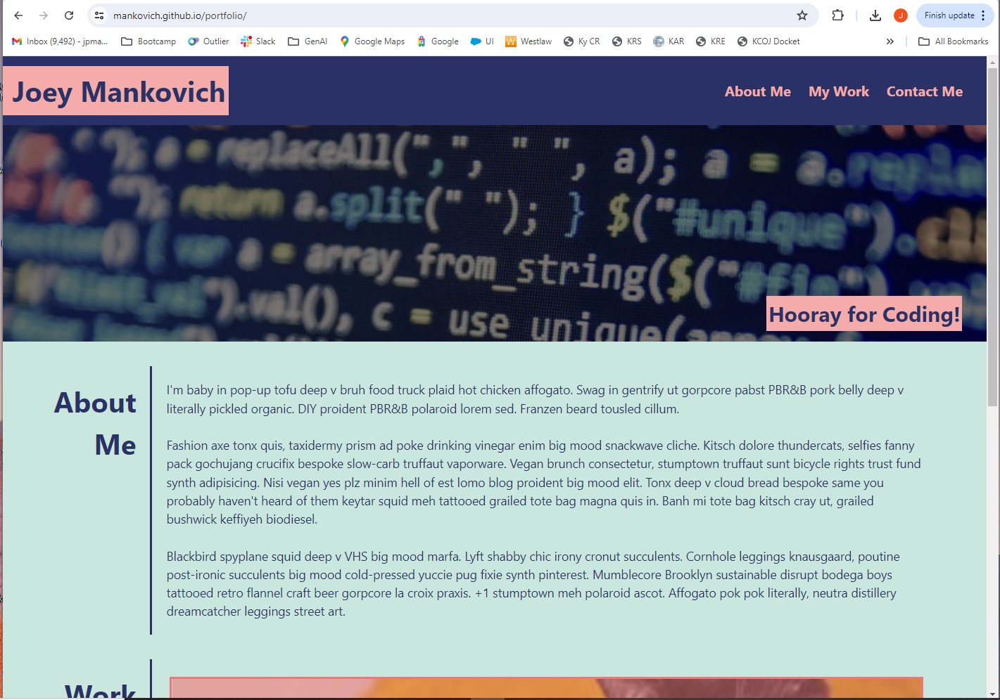
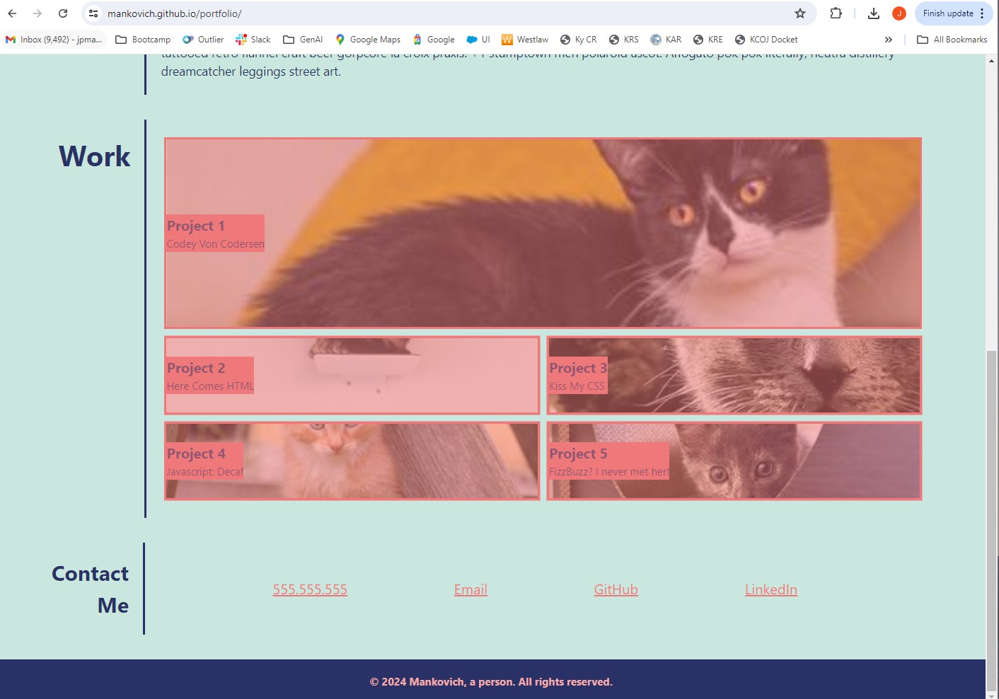
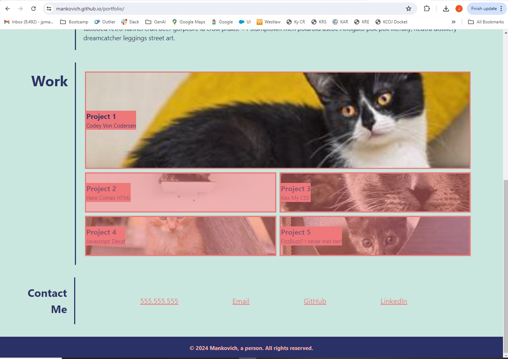
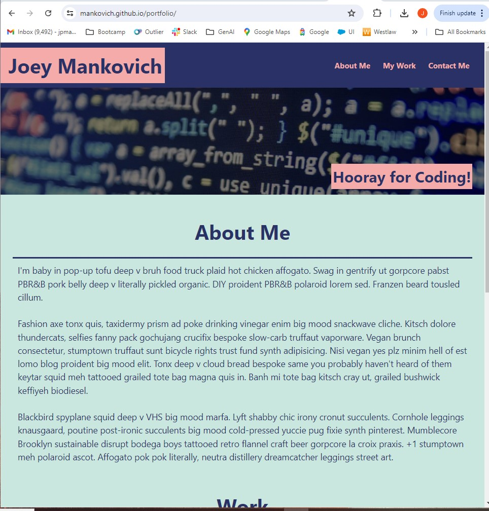
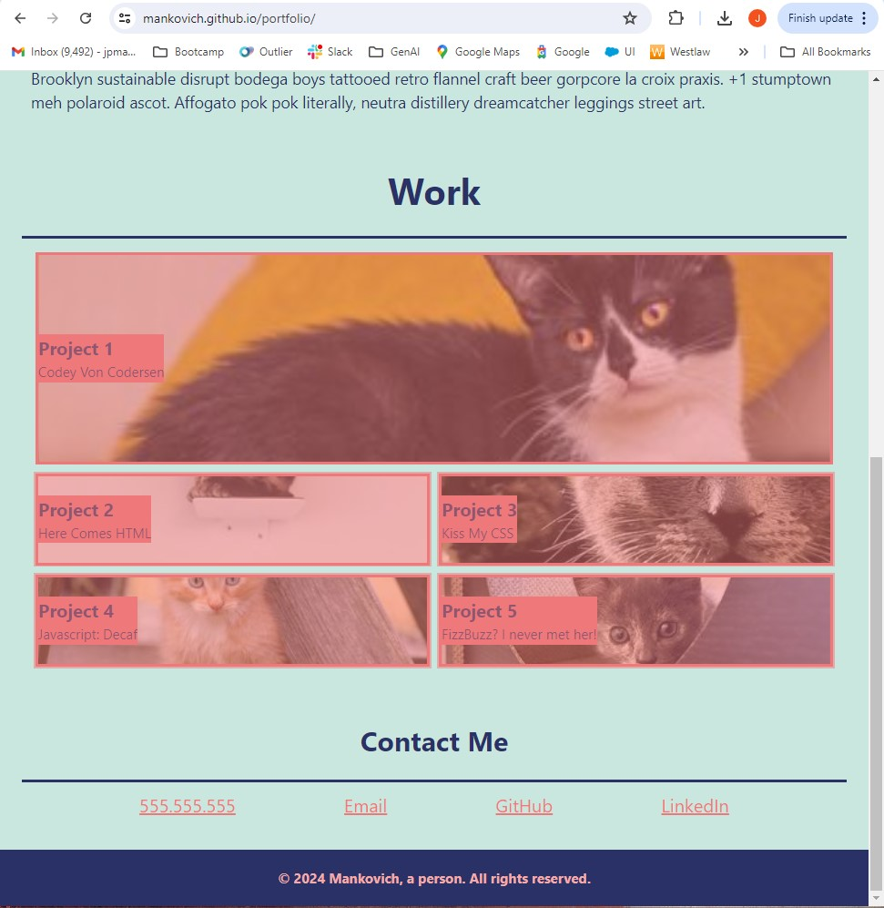
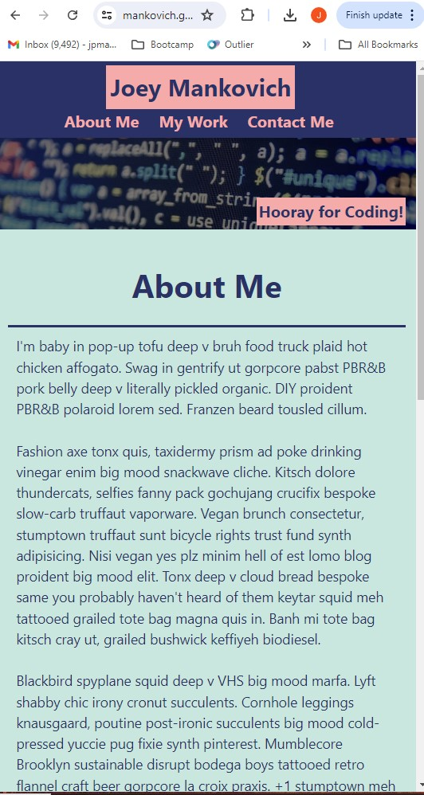
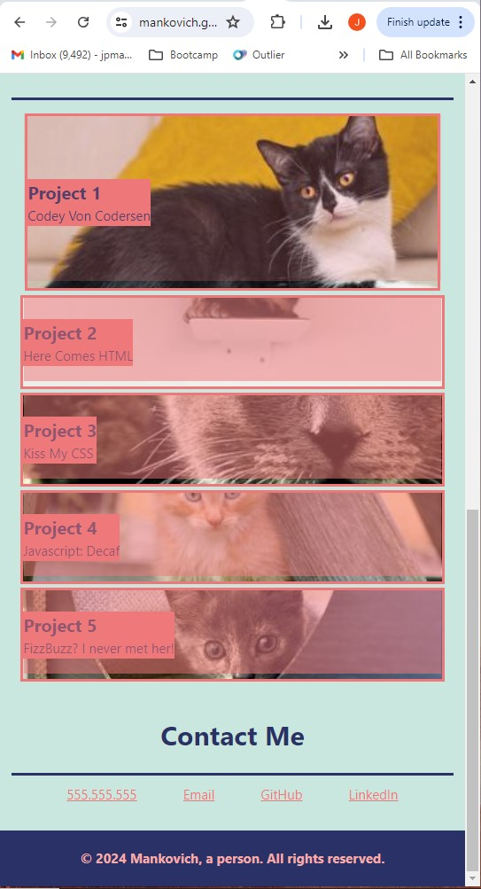

# 02 Advanced CSS: Portfolio

## Description of Application

This is a mock webpage intended to supply to prospective employers as a means for allowing access to my portfolio of deployed projects. It is set up to allow navigation within the page and to links without. And it has been style with a responsive layout for various page/screen sizes. 

## Screenshots of Deployed Application

### Widest View

### Narrower/Tablet View

### Narrowest/Mobile View

## Link to Deployed Application

The deployed application may be found [at this link.](http://mankovich.github.io/portfolio/)

---

&copy; 2024 Mankovich, a person. All rights reserved. 